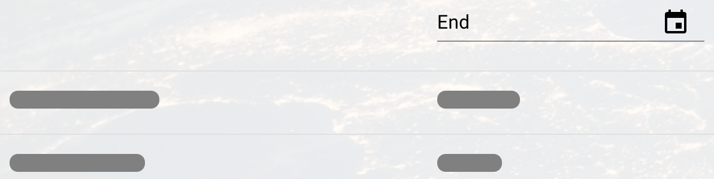

# Spacex React Application
First a few ground rules.
> 📙 **Definition**: This will denote a definition of often used industry lingo

> ℹ️ **Why like this?**: This will denote my explaination for a given implementation

## Run it yourself

> 📙 **React** is a free and open-source front-end JavaScript library for building user interfaces or UI components.

> 📙 **GraphQL** is a specification that describes a consistent query and manipulation language for varying data sources.

> 📙 GraphQL **introspection** enables you to query a GraphQL server for information about the underlying schema


This is **react** application requires [Spacex GraphQL](https://github.com/SkylarWapato/spacex-graphql) to be running because we generate types based off of the server's **introspection** query.

To run the application, run: 

```npm i```

Followed by:

```npm run start```

The console should output something along the lines of

```You can now view spacex-react in the browser```

Your application will be found at [http://localhost:3000/](http://localhost:3000/)

## Features
This application can be sorted or searched on any field other than video link.  We accomplish this using the react useState hook.
> ℹ️ **Why like this?**: The only way to update the view, in this application, is to change one of the sort/search state variables.  The top down flow is as follows: Change variable > query using variables > update views > provide handles to filter components to change variable > repeat.  Once a component changes one of those variables, the process starts again.  This ensures that state can never be corrupted and will always flow down the component hierarchy, to be displayed to the user.

Because no component is permitted to update more than one state variable, when more than one sort/search has been executed they will both be honored, as each field is only permitted to adjust its own state variable.

## Skeletons in the Table
I implemented a simple skeleton load view to make the short wait times feel even shorter.  A skeleton view is a view that appears to display redacted data until the real data is prepared.  It gives the user the feeling that the data is "manifesting" over time, which makes the wait time feel less significant.


## Debounce
We don't want every single keystroke to hit our server with a request.  So, we debounce the input and only change the sort/search variable if a user has paused (very briefly).

## Don't reinvent the wheel
This project would have taken much longer had I not leveraged the material-ui component library.  That library provided the table and date pickers with easy-to-use APIs.  For production projects, you want to thoroughly vet any library you decide to include for sustianability and reliability.  Limiting unnecessary imports is a good way to reduce your attack surface.  Only use well known, trusted libraries.

# That's it!
Please see [Spacex GrapgQL](https://github.com/SkylarWapato/spacex-react) for the server-side portion of this project.